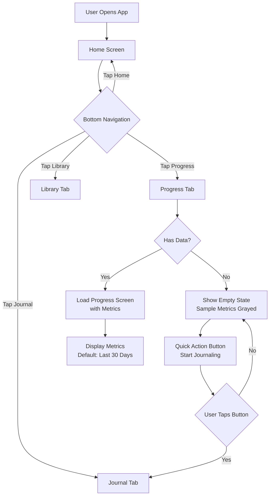
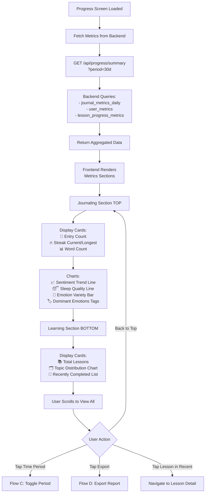
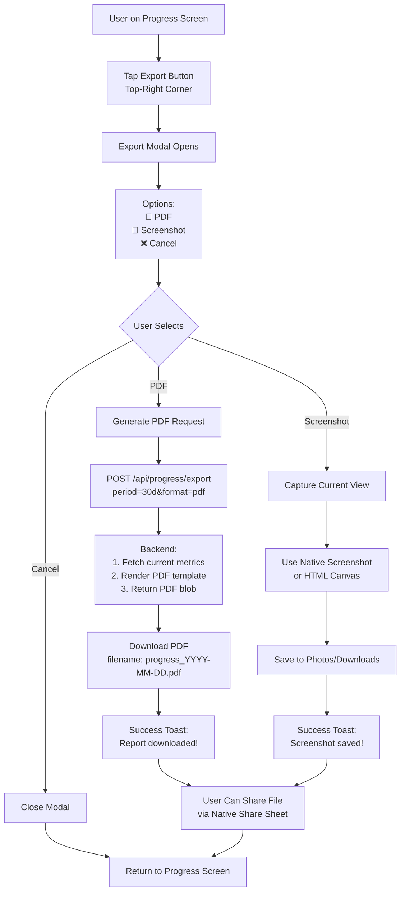
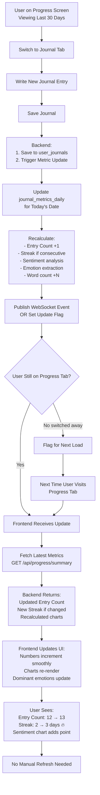
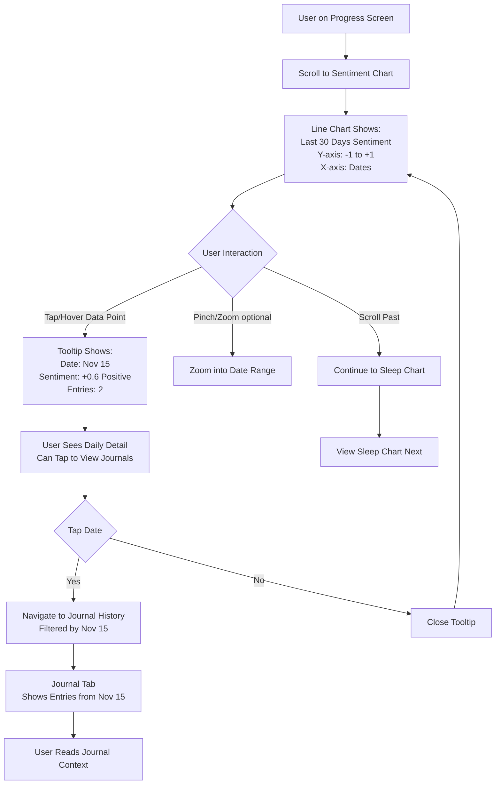
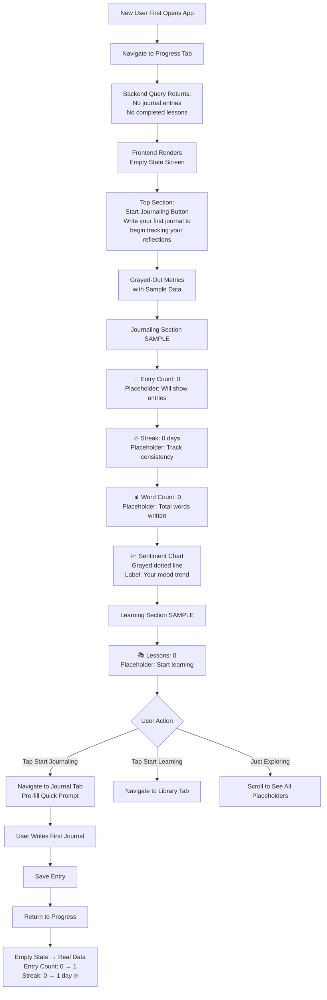
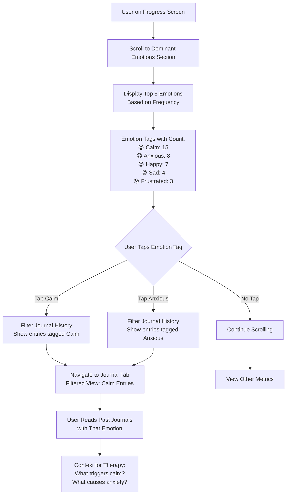
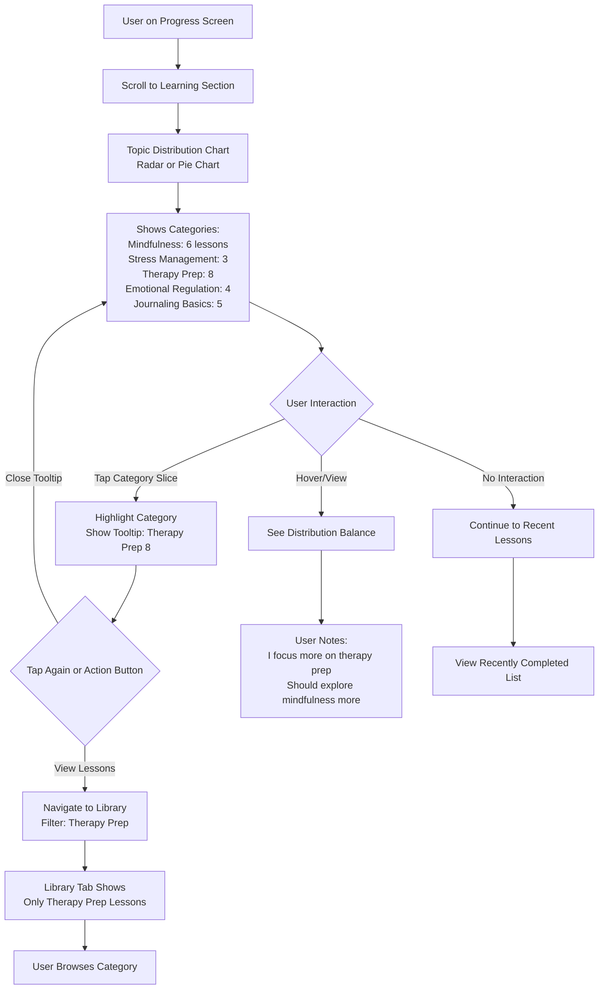
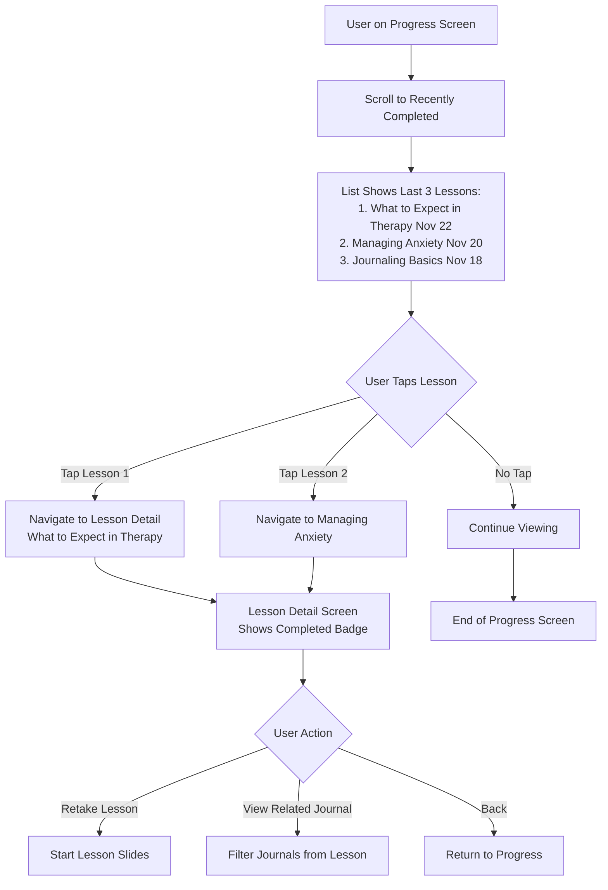

# 🗺️ Progress Tracking - User Flows

## Overview

This document outlines all user journeys within the Progress feature, from navigating to the tab to viewing metrics, toggling time periods, and exporting reports.

---

## Flow A: Navigate to Progress Tab



**Result**: User lands on Progress screen with either real metrics or empty state.

---

## Flow B: View Progress Metrics (Default: Last 30 Days)



**Result**: User sees comprehensive view of their journaling and learning progress.

---

## Flow C: Toggle Time Period

```mermaid
flowchart TD
    A[User on Progress Screen] --> B[Time Period Toggle<br/>Daily | Weekly | Monthly | All Time]
    B --> C[Current: Last 30 Days selected]
    
    C --> D{User Taps Period}
    D -->|Daily| E[Fetch Today's Metrics]
    D -->|Weekly| F[Fetch Last 7 Days]
    D -->|Monthly| G[Fetch Last 30 Days DEFAULT]
    D -->|All Time| H[Fetch All User Data]
    
    E --> I[Update URL Parameter<br/>?period=1d]
    F --> J[Update URL Parameter<br/>?period=7d]
    G --> K[Update URL Parameter<br/>?period=30d]
    H --> L[Update URL Parameter<br/>?period=all]
    
    I --> M[Backend Query:<br/>Filter by Date Range]
    J --> M
    K --> M
    L --> M
    
    M --> N[Recalculate Metrics<br/>for Selected Period]
    N --> O[Return New Data]
    
    O --> P[Frontend Updates:]
    P --> Q[Entry Count changes<br/>Streak recalculated if not All Time<br/>Charts re-render with new data]
    
    Q --> R[Show Loading Indicator<br/>during Transition]
    R --> S[Smooth Animation<br/>Charts/Numbers Update]
    
    S --> T[User Sees Updated Metrics<br/>for New Time Period]
```

**Result**: Metrics dynamically update to reflect selected time period.

---

## Flow D: Export Progress Report



**Result**: User exports progress as PDF or screenshot for personal use or therapist sharing.

---

## Flow E: Real-Time Metric Updates



**Result**: Metrics update immediately when user creates journal entry or completes lesson, even if Progress tab is open.

---

## Flow F: View Sentiment Trend Chart (Drill-Down)



**Result**: Users can drill down into specific dates from charts to see related journal entries.

---

## Flow G: Empty State (New User)



**Result**: New users understand what will be tracked and have clear path to start.

---

## Flow H: View Dominant Emotions



**Result**: Users can explore patterns by filtering journals by dominant emotions.

---

## Flow I: View Learning Topic Distribution



**Result**: Users see learning balance and can navigate to specific categories.

---

## Flow J: View Recently Completed Lessons



**Result**: Users can quickly revisit recently completed lessons.

---

## Summary: Key User Paths

| Flow | Entry Point | Exit Point | Key Data |
|------|-------------|------------|----------|
| **Navigate to Progress** | Bottom Nav | Progress Screen | Load metrics for 30 days |
| **View Metrics** | Progress Screen | Scrollable View | journal_metrics, learning_metrics |
| **Toggle Period** | Time Period Toggle | Updated Metrics | Recalculated for period |
| **Export Report** | Export Button | Downloaded PDF/Screenshot | Current view snapshot |
| **Real-Time Update** | Background (Journal/Lesson) | UI Auto-Refresh | WebSocket or polling |
| **Drill-Down Chart** | Tap Chart Point | Journal History Filtered | Date-specific entries |
| **Empty State** | New User | Start Journaling CTA | Sample metrics |
| **View Emotions** | Dominant Emotions | Filtered Journals | Emotion-tagged entries |
| **Topic Distribution** | Learning Section | Library Filtered | Category lessons |
| **Recent Lessons** | Recently Completed | Lesson Detail | Last 3 completions |

---

**Last Updated**: November 23, 2025
